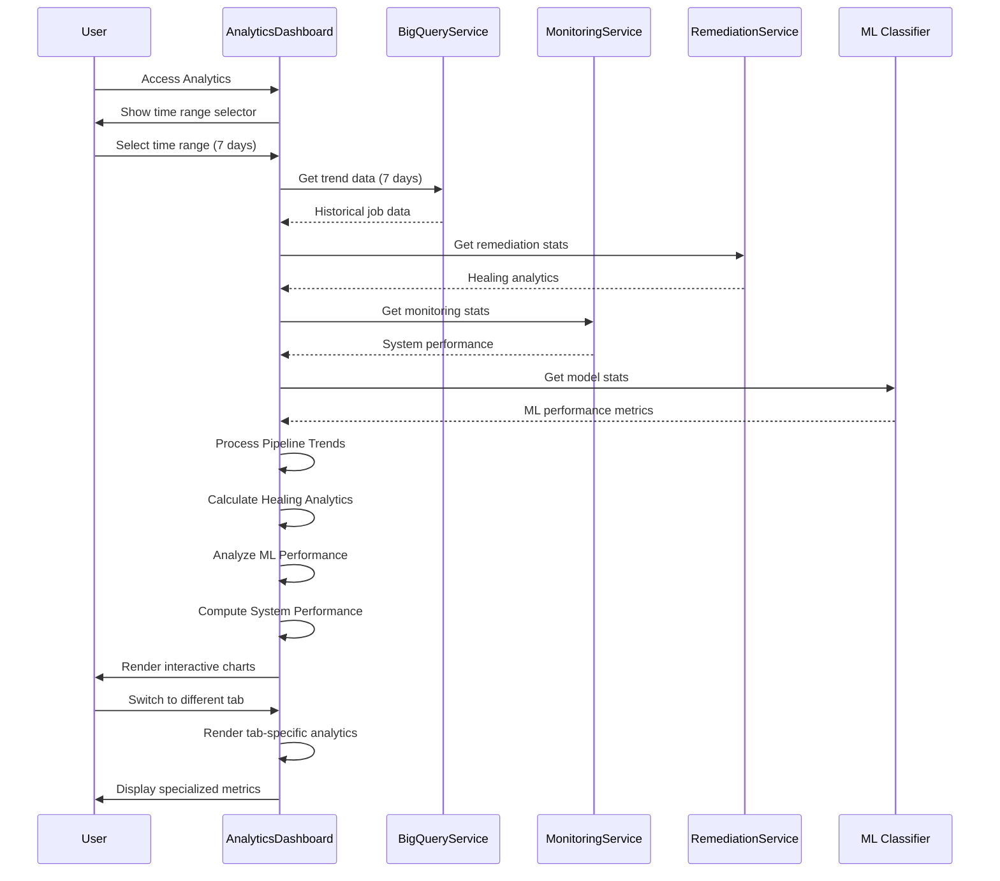
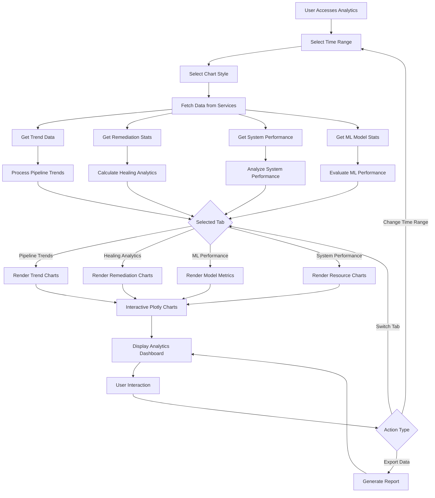
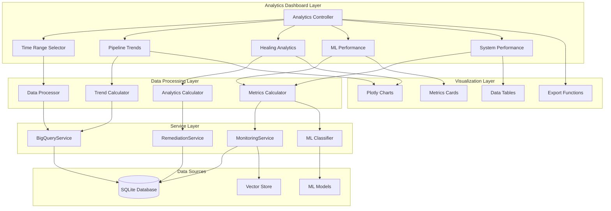

# Analytics Dashboard Architecture Documentation

## Overview

The Analytics Dashboard provides advanced analytics, trend analysis, and ML model performance metrics for the AI-Driven Data Pipeline Monitoring System. It offers deep insights into pipeline performance, healing analytics, machine learning effectiveness, and system performance over configurable time periods.

## 📊 **Page Architecture**

### **Core Components**
1. **Time Range Selector** - Configurable analysis periods (24h, 7d, 30d)
2. **Pipeline Trends Analysis** - Historical performance patterns
3. **Healing Analytics** - Automated remediation effectiveness
4. **ML Performance Metrics** - Model accuracy and prediction analysis
5. **System Performance Dashboard** - Resource utilization and efficiency
6. **Interactive Visualizations** - Plotly-based charts and graphs

### **Data Flow Architecture**
```python
# Core initialization from analytics_dashboard.py
def render_analytics_dashboard():
    # Get services from session state
    bigquery_service = st.session_state.bigquery_service
    monitoring_service = st.session_state.monitoring_service
    remediation_service = st.session_state.remediation_service
    
    # Get configurable data based on time range
    trend_data = bigquery_service.get_trend_data(days=days)
    remediation_stats = remediation_service.get_remediation_stats()
```

## 🔄 **Sequence Diagram**



## 📋 **Flowchart - Analytics Processing**



## 🏗️ **Component Diagram**



## 📈 **Pipeline Trends Analysis**

### **Trend Data Processing**
```python
def render_pipeline_trends(trend_data, days):
    """Render pipeline performance trends over time"""
    
    st.subheader(f"📈 Pipeline Trends - Last {days} Days")
    
    if not trend_data:
        st.info(f"No trend data available for the last {days} days.")
        return
    
    # Process trend data into time series
    df = pd.DataFrame(trend_data)
    df['date'] = pd.to_datetime(df['created_at']).dt.date
    
    # Daily aggregations
    daily_stats = df.groupby('date').agg({
        'job_id': 'count',
        'status': lambda x: (x == 'failed').sum(),
        'auto_healed': 'sum',
        'confidence_score': 'mean'
    }).reset_index()
    
    daily_stats.columns = ['date', 'total_jobs', 'failed_jobs', 'healed_jobs', 'avg_confidence']
    daily_stats['error_rate'] = (daily_stats['failed_jobs'] / daily_stats['total_jobs'] * 100).fillna(0)
    daily_stats['healing_rate'] = (daily_stats['healed_jobs'] / daily_stats['failed_jobs'] * 100).fillna(0)
```

### **Interactive Trend Charts**
```python
# Job volume trend
fig_volume = px.line(
    daily_stats, 
    x='date', 
    y='total_jobs',
    title='Daily Job Volume',
    labels={'total_jobs': 'Number of Jobs', 'date': 'Date'}
)
fig_volume.update_layout(showlegend=False)
st.plotly_chart(fig_volume, use_container_width=True)

# Error rate and healing rate trends
fig_rates = go.Figure()
fig_rates.add_trace(go.Scatter(
    x=daily_stats['date'],
    y=daily_stats['error_rate'],
    name='Error Rate (%)',
    line=dict(color='red')
))
fig_rates.add_trace(go.Scatter(
    x=daily_stats['date'], 
    y=daily_stats['healing_rate'],
    name='Healing Rate (%)',
    line=dict(color='green')
))
fig_rates.update_layout(title='Error Rate vs Healing Rate Trends')
st.plotly_chart(fig_rates, use_container_width=True)
```

## 🔧 **Healing Analytics**

### **Remediation Effectiveness Analysis**
```python
def render_healing_analytics(remediation_stats, bigquery_service):
    """Render automated healing analytics and success metrics"""
    
    st.subheader("🔧 Self-Healing Analytics")
    
    # Overall healing metrics
    col1, col2, col3, col4 = st.columns(4)
    
    with col1:
        total_attempts = remediation_stats.get('total_attempts', 0)
        st.metric("Total Healing Attempts", total_attempts)
    
    with col2:
        successful_healing = remediation_stats.get('successful_healing', 0)
        success_rate = (successful_healing / total_attempts * 100) if total_attempts > 0 else 0
        st.metric("Success Rate", f"{success_rate:.1f}%")
    
    with col3:
        avg_healing_time = remediation_stats.get('avg_healing_time', 0)
        st.metric("Avg Healing Time", f"{avg_healing_time:.1f}s")
    
    with col4:
        cost_savings = remediation_stats.get('estimated_cost_savings', 0)
        st.metric("Est. Cost Savings", f"${cost_savings:,.2f}")
```

### **Strategy Performance Analysis**
```python
# Remediation strategy performance
strategy_performance = bigquery_service.get_strategy_performance()

if strategy_performance:
    strategies_df = pd.DataFrame(strategy_performance)
    
    # Success rate by strategy
    fig_strategies = px.bar(
        strategies_df,
        x='strategy',
        y='success_rate',
        color='success_rate',
        title='Remediation Strategy Success Rates',
        labels={'success_rate': 'Success Rate (%)', 'strategy': 'Strategy'}
    )
    st.plotly_chart(fig_strategies, use_container_width=True)
    
    # Strategy usage frequency
    fig_usage = px.pie(
        strategies_df,
        values='usage_count',
        names='strategy',
        title='Strategy Usage Distribution'
    )
    st.plotly_chart(fig_usage, use_container_width=True)
```

## 🤖 **ML Performance Metrics**

### **Model Performance Analysis**
```python
def render_ml_performance(monitoring_service):
    """Render machine learning model performance metrics"""
    
    st.subheader("🤖 ML Model Performance")
    
    # Get ML classifier stats
    classifier = monitoring_service.error_classifier
    model_stats = classifier.get_model_stats()
    
    if 'error' not in model_stats:
        # Performance metrics display
        col1, col2, col3, col4 = st.columns(4)
        
        with col1:
            accuracy = model_stats.get('accuracy', 0)
            st.metric("Model Accuracy", f"{accuracy:.1%}")
        
        with col2:
            precision = model_stats.get('precision', 0)  
            st.metric("Precision", f"{precision:.1%}")
        
        with col3:
            recall = model_stats.get('recall', 0)
            st.metric("Recall", f"{recall:.1%}")
        
        with col4:
            f1_score = model_stats.get('f1_score', 0)
            st.metric("F1 Score", f"{f1_score:.3f}")
```

### **Classification Distribution**
```python
# Error type classification distribution
if 'class_distribution' in model_stats:
    class_dist = model_stats['class_distribution']
    
    # Convert to DataFrame for visualization
    dist_df = pd.DataFrame(list(class_dist.items()), columns=['Error Type', 'Count'])
    
    # Classification distribution chart
    fig_dist = px.bar(
        dist_df,
        x='Error Type',
        y='Count', 
        title='Error Type Classification Distribution',
        color='Count'
    )
    fig_dist.update_xaxes(tickangle=45)
    st.plotly_chart(fig_dist, use_container_width=True)
```

### **Confidence Score Analysis**
```python
# Confidence score distribution
confidence_data = bigquery_service.get_confidence_distribution()

if confidence_data:
    conf_df = pd.DataFrame(confidence_data)
    
    # Confidence histogram
    fig_conf = px.histogram(
        conf_df,
        x='confidence_score',
        nbins=20,
        title='Confidence Score Distribution',
        labels={'confidence_score': 'Confidence Score', 'count': 'Frequency'}
    )
    
    # Add threshold line at 75%
    fig_conf.add_vline(x=0.75, line_dash="dash", line_color="red", 
                      annotation_text="Auto-remediation threshold (75%)")
    
    st.plotly_chart(fig_conf, use_container_width=True)
```

## ⚡ **System Performance Dashboard**

### **Resource Utilization Monitoring**
```python
def render_system_performance(monitoring_service, remediation_service, bigquery_service):
    """Render system performance and resource utilization metrics"""
    
    st.subheader("⚡ System Performance Metrics")
    
    # System resource metrics
    col1, col2, col3, col4 = st.columns(4)
    
    with col1:
        cpu_usage = monitoring_service.get_cpu_usage()
        st.metric("CPU Usage", f"{cpu_usage}%")
    
    with col2:
        memory_usage = monitoring_service.get_memory_usage()
        st.metric("Memory Usage", f"{memory_usage}%")
    
    with col3:
        db_size = bigquery_service.get_database_size()
        st.metric("Database Size", f"{db_size:.1f}MB")
    
    with col4:
        active_connections = bigquery_service.get_active_connections()
        st.metric("Active Connections", active_connections)
```

### **Throughput Analysis**
```python
# Processing throughput metrics
throughput_data = monitoring_service.get_throughput_stats()

if throughput_data:
    throughput_df = pd.DataFrame(throughput_data)
    
    # Events processed per hour
    fig_throughput = px.line(
        throughput_df,
        x='hour',
        y='events_processed',
        title='Hourly Event Processing Throughput',
        labels={'events_processed': 'Events Processed', 'hour': 'Hour'}
    )
    st.plotly_chart(fig_throughput, use_container_width=True)
    
    # Average processing time
    fig_latency = px.line(
        throughput_df,
        x='hour',
        y='avg_processing_time',
        title='Average Event Processing Time',
        labels={'avg_processing_time': 'Processing Time (ms)', 'hour': 'Hour'}
    )
    st.plotly_chart(fig_latency, use_container_width=True)
```

## 📊 **Advanced Analytics Features**

### **Time Range Configuration**
```python
# Dynamic time range mapping
time_range_map = {
    "Last 24 hours": 1,
    "Last 7 days": 7, 
    "Last 30 days": 30
}
days = time_range_map[time_range]

# Adaptive data fetching based on time range
if days == 1:
    # Hourly granularity for 24 hours
    trend_data = bigquery_service.get_hourly_trend_data(hours=24)
elif days <= 7:
    # Daily granularity for week view
    trend_data = bigquery_service.get_daily_trend_data(days=days)
else:
    # Weekly granularity for month view  
    trend_data = bigquery_service.get_weekly_trend_data(weeks=days//7)
```

### **Interactive Chart Controls**
```python
# Chart style selection
with col2:
    chart_type = st.selectbox(
        "Chart Style",
        ["Interactive", "Static"],
        index=0
    )

# Conditional rendering based on chart type
if chart_type == "Interactive":
    st.plotly_chart(fig, use_container_width=True)
else:
    # Static matplotlib version for better performance
    st.pyplot(fig_static)
```

## 📈 **Export and Reporting**

### **Data Export Functionality**
```python
# Export data to CSV
def export_analytics_data(trend_data, remediation_stats):
    """Export analytics data for external analysis"""
    
    # Prepare export data
    export_data = {
        'trend_data': pd.DataFrame(trend_data),
        'remediation_stats': pd.DataFrame([remediation_stats]),
        'export_timestamp': datetime.now().isoformat()
    }
    
    # Create downloadable CSV
    csv_buffer = io.StringIO()
    export_data['trend_data'].to_csv(csv_buffer, index=False)
    
    st.download_button(
        label="📥 Download Analytics Data",
        data=csv_buffer.getvalue(),
        file_name=f"pipeline_analytics_{datetime.now().strftime('%Y%m%d_%H%M%S')}.csv",
        mime="text/csv"
    )
```

### **Automated Reporting**
```python
# Generate summary report
def generate_analytics_summary(trend_data, remediation_stats, model_stats):
    """Generate executive summary of analytics"""
    
    summary = {
        'reporting_period': f"Last {days} days",
        'total_jobs_processed': len(trend_data),
        'overall_error_rate': f"{error_rate:.1f}%",
        'healing_success_rate': f"{healing_success_rate:.1f}%", 
        'model_accuracy': f"{model_stats.get('accuracy', 0):.1%}",
        'cost_savings': f"${remediation_stats.get('estimated_cost_savings', 0):,.2f}",
        'recommendations': generate_recommendations(trend_data, remediation_stats)
    }
    
    return summary
```

## 🎯 **Key Features Summary**

### **Advanced Analytics Capabilities**
- **Multi-timeframe Analysis**: 24h, 7d, 30d views with adaptive granularity
- **Interactive Visualizations**: Plotly-based charts with zoom, pan, hover
- **Comparative Analytics**: Trend analysis with delta calculations
- **Performance Benchmarking**: Model accuracy tracking over time

### **Remediation Intelligence**
- **Strategy Effectiveness**: Success rates by remediation type
- **Cost Impact Analysis**: Estimated savings from automated healing  
- **Time-to-Resolution**: Healing duration trends and optimization
- **Pattern Recognition**: Error clustering and correlation analysis

### **ML Model Insights**
- **Accuracy Monitoring**: Real-time model performance tracking
- **Confidence Analysis**: Distribution of prediction confidence scores
- **Feature Importance**: Top factors in error classification
- **Model Drift Detection**: Performance degradation alerts

### **System Optimization**
- **Resource Utilization**: CPU, memory, database metrics
- **Throughput Analysis**: Processing capacity and bottlenecks  
- **Latency Monitoring**: Response time optimization opportunities
- **Scalability Planning**: Growth trend projections

The Analytics Dashboard provides comprehensive insights into system performance, enabling data-driven decision making for pipeline optimization, cost reduction, and operational excellence.