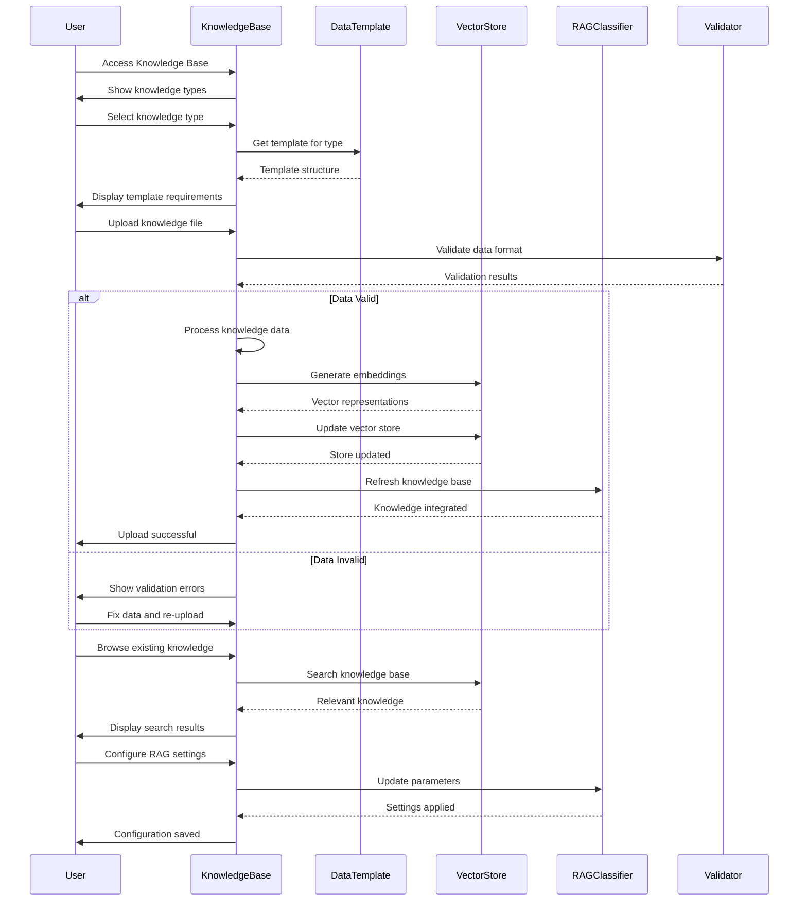
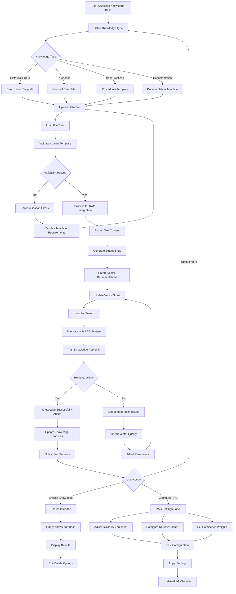
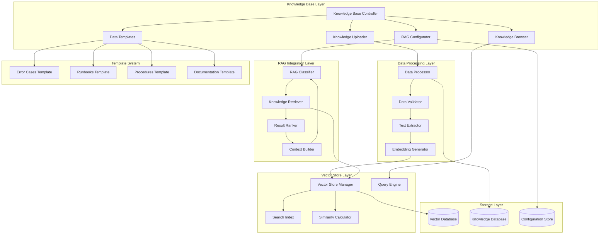

# Knowledge Base Management Architecture Documentation

## Overview

The Knowledge Base Management Dashboard provides comprehensive tools for uploading, managing, and configuring structured knowledge that enhances the RAG (Retrieval-Augmented Generation) system. It enables users to build a rich repository of historical error cases, troubleshooting runbooks, best practices, and procedural knowledge that improves error classification and remediation accuracy.

## 📊 **Page Architecture**

### **Core Components**
1. **Knowledge Upload Interface** - Multi-format data ingestion and processing
2. **Data Templates System** - Structured templates for different knowledge types
3. **Knowledge Base Browser** - Search, filter, and manage existing knowledge
4. **RAG Configuration Panel** - Fine-tune retrieval and generation parameters
5. **Vector Store Management** - Manage embeddings and similarity search
6. **Knowledge Validation** - Ensure data quality and consistency

### **Data Flow Architecture**
```python
# Core initialization from knowledge_base.py
def render_knowledge_base():
    # Four main functional tabs
    tabs = ["Upload Knowledge", "Data Templates", "Browse Knowledge Base", "RAG Configuration"]
    
    # Knowledge processing pipeline
    if uploaded_file:
        df = load_knowledge_data(uploaded_file, knowledge_type)
        validated_data = validate_knowledge_format(df, knowledge_type)
        processed_knowledge = process_knowledge_for_rag(validated_data)
        update_vector_store(processed_knowledge)
```

## 🔄 **Sequence Diagram**



## 📋 **Flowchart - Knowledge Processing Pipeline**



## 🏗️ **Component Diagram**



## 📤 **Knowledge Upload and Processing**

### **Knowledge Type Classification**
```python
def render_knowledge_upload():
    """Render knowledge base upload interface with type-specific processing"""
    
    st.subheader("📤 Upload Knowledge Base Data")
    
    # Knowledge type selection with descriptions
    knowledge_types = {
        "Historical Error Cases": {
            "description": "Past error instances with resolutions and outcomes",
            "template": "error_cases_template.csv",
            "required_fields": ["error_message", "error_type", "resolution_strategy", "success"]
        },
        "Troubleshooting Runbooks": {
            "description": "Step-by-step procedures for common issues",
            "template": "runbooks_template.csv", 
            "required_fields": ["title", "error_patterns", "steps", "success_criteria"]
        },
        "Best Practices & Procedures": {
            "description": "Proven practices and standard procedures",
            "template": "procedures_template.csv",
            "required_fields": ["title", "category", "description", "steps"]
        },
        "Infrastructure Documentation": {
            "description": "System architecture and configuration details",
            "template": "infrastructure_template.csv",
            "required_fields": ["component", "description", "configuration", "dependencies"]
        },
        "Team Expertise & Lessons Learned": {
            "description": "Tribal knowledge and lessons from incidents",
            "template": "expertise_template.csv",
            "required_fields": ["topic", "expert", "lesson", "context"]
        }
    }
    
    selected_type = st.selectbox(
        "Select Knowledge Type",
        list(knowledge_types.keys()),
        help="Choose the type of knowledge you're uploading for proper processing"
    )
    
    # Display type-specific information
    type_info = knowledge_types[selected_type]
    
    with st.expander("ℹ️ Knowledge Type Information", expanded=True):
        st.write(f"**Description:** {type_info['description']}")
        st.write(f"**Template:** {type_info['template']}")
        st.write(f"**Required Fields:** {', '.join(type_info['required_fields'])}")
```

### **File Processing and Validation**
```python
def process_knowledge_upload(uploaded_file, knowledge_type: str):
    """Process uploaded knowledge data with type-specific validation"""
    
    try:
        # Load data based on file type
        if uploaded_file.name.endswith('.csv'):
            df = pd.read_csv(uploaded_file)
        elif uploaded_file.name.endswith(('.xlsx', '.xls')):
            df = pd.read_excel(uploaded_file)
        else:
            st.error("❌ Unsupported file format. Please use CSV or Excel files.")
            return None
        
        # Display data preview
        st.success(f"✅ File loaded: {len(df)} rows, {len(df.columns)} columns")
        
        with st.expander("📊 Data Preview", expanded=True):
            st.dataframe(df.head(10), use_container_width=True)
            
            # Data quality metrics
            col1, col2, col3, col4 = st.columns(4)
            with col1:
                st.metric("Total Rows", len(df))
            with col2:
                st.metric("Columns", len(df.columns))
            with col3:
                missing_values = df.isnull().sum().sum()
                st.metric("Missing Values", missing_values)
            with col4:
                duplicate_rows = df.duplicated().sum()
                st.metric("Duplicates", duplicate_rows)
        
        # Validate knowledge format
        validation_result = validate_knowledge_format(df, knowledge_type)
        display_knowledge_validation(validation_result)
        
        if validation_result['is_valid']:
            # Process for RAG integration
            processed_knowledge = prepare_knowledge_for_rag(df, knowledge_type, validation_result)
            
            # Upload to vector store
            upload_result = upload_to_vector_store(processed_knowledge, knowledge_type)
            display_upload_results(upload_result)
            
            return processed_knowledge
        
    except Exception as e:
        st.error(f"❌ Error processing file: {str(e)}")
        return None

def validate_knowledge_format(df: pd.DataFrame, knowledge_type: str) -> Dict[str, Any]:
    """Validate knowledge data against type-specific requirements"""
    
    validation = {
        'is_valid': True,
        'errors': [],
        'warnings': [],
        'metrics': {}
    }
    
    # Get type-specific requirements
    type_requirements = get_knowledge_type_requirements(knowledge_type)
    required_fields = type_requirements['required_fields']
    optional_fields = type_requirements.get('optional_fields', [])
    
    # Check required fields
    missing_fields = [field for field in required_fields if field not in df.columns]
    if missing_fields:
        validation['is_valid'] = False
        validation['errors'].append(f"Missing required fields: {missing_fields}")
    
    # Check data quality
    for field in required_fields:
        if field in df.columns:
            null_count = df[field].isnull().sum()
            if null_count > 0:
                validation['warnings'].append(f"Field '{field}' has {null_count} empty values")
    
    # Type-specific validation
    if knowledge_type == "Historical Error Cases":
        validate_error_cases(df, validation)
    elif knowledge_type == "Troubleshooting Runbooks":
        validate_runbooks(df, validation)
    elif knowledge_type == "Best Practices & Procedures":
        validate_procedures(df, validation)
    
    # Calculate quality metrics
    validation['metrics'] = {
        'completeness': calculate_completeness_score(df, required_fields),
        'consistency': calculate_consistency_score(df),
        'uniqueness': calculate_uniqueness_score(df)
    }
    
    return validation
```

## 📚 **Data Templates System**

### **Template Generation and Management**
```python
def render_data_templates():
    """Render data templates and examples for different knowledge types"""
    
    st.subheader("📋 Knowledge Data Templates")
    
    # Template selection
    template_type = st.selectbox(
        "Select Template Type",
        [
            "Historical Error Cases",
            "Troubleshooting Runbooks", 
            "Best Practices & Procedures",
            "Infrastructure Documentation",
            "Team Expertise & Lessons Learned"
        ]
    )
    
    # Generate and display template
    template_data = generate_template_data(template_type)
    
    # Template preview
    st.markdown(f"### 📄 {template_type} Template")
    
    # Show template structure
    with st.expander("📋 Template Structure", expanded=True):
        template_df = pd.DataFrame(template_data['sample_data'])
        st.dataframe(template_df, use_container_width=True)
    
    # Field descriptions
    with st.expander("📖 Field Descriptions"):
        for field, description in template_data['field_descriptions'].items():
            st.write(f"**{field}**: {description}")
    
    # Download template
    col1, col2 = st.columns(2)
    
    with col1:
        # CSV download
        csv_data = template_df.to_csv(index=False)
        st.download_button(
            label="📥 Download CSV Template",
            data=csv_data,
            file_name=f"{template_type.lower().replace(' ', '_')}_template.csv",
            mime="text/csv"
        )
    
    with col2:
        # Excel download
        excel_buffer = io.BytesIO()
        template_df.to_excel(excel_buffer, index=False)
        st.download_button(
            label="📥 Download Excel Template",
            data=excel_buffer.getvalue(),
            file_name=f"{template_type.lower().replace(' ', '_')}_template.xlsx",
            mime="application/vnd.openxmlformats-officedocument.spreadsheetml.sheet"
        )

def generate_template_data(template_type: str) -> Dict[str, Any]:
    """Generate template data and examples for different knowledge types"""
    
    templates = {
        "Historical Error Cases": {
            "sample_data": [
                {
                    "error_message": "BigQuery access denied for dataset project.dataset",
                    "error_type": "permission_denied",
                    "resolution_strategy": "Added BigQuery Data Editor role to service account",
                    "success": True,
                    "resolution_time_minutes": 5,
                    "business_impact": "low",
                    "context": "Daily ETL pipeline failure"
                },
                {
                    "error_message": "Connection timeout after 30 seconds",
                    "error_type": "network_timeout", 
                    "resolution_strategy": "Increased connection timeout and added retry logic",
                    "success": True,
                    "resolution_time_minutes": 15,
                    "business_impact": "medium",
                    "context": "High network latency during peak hours"
                }
            ],
            "field_descriptions": {
                "error_message": "The actual error message or log entry",
                "error_type": "Classification category (permission_denied, network_timeout, etc.)",
                "resolution_strategy": "How the error was resolved",
                "success": "Whether the resolution was successful (True/False)",
                "resolution_time_minutes": "Time taken to resolve the issue",
                "business_impact": "Impact level (low, medium, high)",
                "context": "Additional context about when/why error occurred"
            }
        },
        
        "Troubleshooting Runbooks": {
            "sample_data": [
                {
                    "title": "BigQuery Permission Errors",
                    "error_patterns": "access denied, permission denied, insufficient privileges",
                    "steps": "1. Check service account permissions 2. Verify dataset access 3. Add required roles",
                    "success_criteria": "Query executes without permission errors",
                    "category": "permissions",
                    "estimated_time": 10,
                    "skill_level": "intermediate"
                }
            ],
            "field_descriptions": {
                "title": "Descriptive title for the runbook",
                "error_patterns": "Common error message patterns this addresses",
                "steps": "Step-by-step resolution procedure",
                "success_criteria": "How to verify the issue is resolved",
                "category": "Type of issue (permissions, network, data, etc.)",
                "estimated_time": "Expected resolution time in minutes",
                "skill_level": "Required expertise level (beginner, intermediate, advanced)"
            }
        }
    }
    
    return templates.get(template_type, {"sample_data": [], "field_descriptions": {}})
```

## 🔍 **Knowledge Base Browser**

### **Advanced Search and Filtering**
```python
def render_knowledge_browser():
    """Render knowledge base browsing and search interface"""
    
    st.subheader("🔍 Browse Knowledge Base")
    
    # Search controls
    col1, col2, col3 = st.columns([2, 1, 1])
    
    with col1:
        search_query = st.text_input(
            "🔍 Search Knowledge Base",
            placeholder="Enter search terms or error messages..."
        )
    
    with col2:
        knowledge_filter = st.selectbox(
            "Filter by Type",
            ["All Types", "Error Cases", "Runbooks", "Procedures", "Documentation", "Expertise"]
        )
    
    with col3:
        sort_by = st.selectbox(
            "Sort by",
            ["Relevance", "Date Added", "Success Rate", "Usage Count"]
        )
    
    # Advanced search options
    with st.expander("🔧 Advanced Search Options"):
        col1, col2, col3 = st.columns(3)
        
        with col1:
            date_range = st.date_input(
                "Date Range",
                value=[datetime.now().date() - timedelta(days=30), datetime.now().date()]
            )
        
        with col2:
            min_success_rate = st.slider(
                "Minimum Success Rate",
                min_value=0.0, max_value=1.0, value=0.0, step=0.1
            )
        
        with col3:
            similarity_threshold = st.slider(
                "Similarity Threshold",
                min_value=0.1, max_value=1.0, value=0.5, step=0.1
            )
    
    # Perform search
    if search_query or knowledge_filter != "All Types":
        search_results = search_knowledge_base(
            query=search_query,
            knowledge_type=knowledge_filter,
            date_range=date_range,
            min_success_rate=min_success_rate,
            similarity_threshold=similarity_threshold,
            sort_by=sort_by
        )
        
        # Display results
        display_search_results(search_results)
    else:
        # Show knowledge base statistics
        display_knowledge_statistics()

def search_knowledge_base(query: str, **filters) -> List[Dict[str, Any]]:
    """Search knowledge base with advanced filtering and ranking"""
    
    # Get RAG classifier from session state
    if 'monitoring_service' in st.session_state:
        rag_classifier = st.session_state.monitoring_service.error_classifier
        
        if hasattr(rag_classifier, 'search_knowledge'):
            # Use RAG search capabilities
            results = rag_classifier.search_knowledge(query, k=20)
            
            # Apply additional filters
            filtered_results = apply_search_filters(results, **filters)
            
            # Rank and sort results
            ranked_results = rank_search_results(filtered_results, filters.get('sort_by', 'Relevance'))
            
            return ranked_results
    
    return []

def display_search_results(results: List[Dict[str, Any]]):
    """Display knowledge base search results with interactive features"""
    
    if not results:
        st.info("No results found. Try adjusting your search criteria.")
        return
    
    st.write(f"Found {len(results)} results")
    
    for i, result in enumerate(results):
        with st.expander(f"📄 {result.get('title', f'Result {i+1}')}", expanded=False):
            col1, col2 = st.columns([3, 1])
            
            with col1:
                # Display main content
                st.write(f"**Type:** {result.get('knowledge_type', 'Unknown')}")
                st.write(f"**Content:** {result.get('content', 'N/A')[:200]}...")
                
                if result.get('error_type'):
                    st.write(f"**Error Type:** {result['error_type']}")
                
                if result.get('success_rate'):
                    st.write(f"**Success Rate:** {result['success_rate']:.1%}")
                
                st.write(f"**Added:** {result.get('created_at', 'Unknown')}")
                st.write(f"**Similarity Score:** {result.get('similarity_score', 0):.2f}")
            
            with col2:
                # Action buttons
                if st.button(f"📝 Edit", key=f"edit_{i}"):
                    edit_knowledge_item(result)
                
                if st.button(f"🗑️ Delete", key=f"delete_{i}"):
                    delete_knowledge_item(result['id'])
                    st.success("Item deleted")
                    st.rerun()
                
                if st.button(f"📋 Copy", key=f"copy_{i}"):
                    copy_to_clipboard(result['content'])
                    st.success("Copied to clipboard")
```

## ⚙️ **RAG Configuration Panel**

### **Retrieval and Generation Settings**
```python
def render_rag_configuration():
    """Render RAG system configuration interface"""
    
    st.subheader("⚙️ RAG System Configuration")
    
    # Get current RAG settings
    if 'monitoring_service' in st.session_state:
        rag_classifier = st.session_state.monitoring_service.error_classifier
        
        if hasattr(rag_classifier, 'get_classification_stats'):
            current_config = rag_classifier.get_classification_stats()
            rag_config = current_config.get('rag_config', {})
            
            # Configuration tabs
            config_tab1, config_tab2, config_tab3 = st.tabs([
                "🔍 Retrieval Settings",
                "🎯 Generation Settings", 
                "📊 Performance Tuning"
            ])
            
            with config_tab1:
                render_retrieval_settings(rag_config)
            
            with config_tab2:
                render_generation_settings(rag_config)
            
            with config_tab3:
                render_performance_settings(rag_config)

def render_retrieval_settings(current_config: Dict[str, Any]):
    """Configure knowledge retrieval parameters"""
    
    st.markdown("### 🔍 Knowledge Retrieval Configuration")
    
    col1, col2 = st.columns(2)
    
    with col1:
        similarity_threshold = st.slider(
            "Similarity Threshold",
            min_value=0.1, max_value=1.0, 
            value=current_config.get('similarity_threshold', 0.5),
            step=0.05,
            help="Minimum similarity score for knowledge retrieval"
        )
        
        max_retrieved_docs = st.slider(
            "Maximum Retrieved Documents",
            min_value=1, max_value=20,
            value=current_config.get('max_retrieved_docs', 5),
            help="Number of similar documents to retrieve"
        )
    
    with col2:
        retrieval_strategy = st.selectbox(
            "Retrieval Strategy",
            ["Semantic Similarity", "Keyword Matching", "Hybrid"],
            index=0
        )
        
        rerank_results = st.checkbox(
            "Re-rank Retrieved Results",
            value=current_config.get('rerank_results', True),
            help="Apply additional ranking to retrieved documents"
        )
    
    # Advanced retrieval settings
    with st.expander("🔧 Advanced Retrieval Settings"):
        col1, col2, col3 = st.columns(3)
        
        with col1:
            embedding_model = st.selectbox(
                "Embedding Model",
                ["TF-IDF", "Word2Vec", "BERT", "Custom"],
                index=0
            )
        
        with col2:
            context_window = st.number_input(
                "Context Window Size",
                min_value=100, max_value=2000,
                value=current_config.get('context_window', 500),
                help="Maximum context length for retrieval"
            )
        
        with col3:
            diversification = st.slider(
                "Result Diversification",
                min_value=0.0, max_value=1.0,
                value=current_config.get('diversification', 0.3),
                help="Balance between relevance and diversity"
            )

def render_generation_settings(current_config: Dict[str, Any]):
    """Configure response generation parameters"""
    
    st.markdown("### 🎯 Response Generation Configuration") 
    
    col1, col2 = st.columns(2)
    
    with col1:
        confidence_boost_threshold = st.slider(
            "Confidence Boost Threshold",
            min_value=0.1, max_value=1.0,
            value=current_config.get('confidence_boost_threshold', 0.7),
            help="Threshold for applying RAG confidence boost"
        )
        
        rag_weight = st.slider(
            "RAG Influence Weight",
            min_value=0.0, max_value=1.0,
            value=current_config.get('rag_weight', 0.6),
            help="How much RAG findings influence final classification"
        )
    
    with col2:
        fallback_strategy = st.selectbox(
            "Fallback Strategy",
            ["Traditional ML", "Human Escalation", "Default Response"],
            index=0,
            help="What to do when RAG confidence is low"
        )
        
        use_context_filtering = st.checkbox(
            "Context-Aware Filtering",
            value=current_config.get('context_filtering', True),
            help="Filter results based on contextual relevance"
        )
    
    # Response customization
    with st.expander("📝 Response Customization"):
        col1, col2 = st.columns(2)
        
        with col1:
            response_format = st.selectbox(
                "Response Format",
                ["Structured", "Natural Language", "Bullet Points"],
                index=0
            )
        
        with col2:
            include_sources = st.checkbox(
                "Include Source References",
                value=True,
                help="Include references to knowledge sources in responses"
            )

def render_performance_settings(current_config: Dict[str, Any]):
    """Configure performance and optimization settings"""
    
    st.markdown("### 📊 Performance Optimization")
    
    # Performance metrics display
    knowledge_stats = get_knowledge_base_stats()
    
    col1, col2, col3, col4 = st.columns(4)
    
    with col1:
        st.metric("Knowledge Items", knowledge_stats.get('total_documents', 0))
    
    with col2:
        st.metric("Vector Store Size", f"{knowledge_stats.get('vector_store_size', 0):.1f}MB")
    
    with col3:
        avg_retrieval_time = knowledge_stats.get('avg_retrieval_time', 0)
        st.metric("Avg Retrieval Time", f"{avg_retrieval_time:.2f}s")
    
    with col4:
        cache_hit_rate = knowledge_stats.get('cache_hit_rate', 0)
        st.metric("Cache Hit Rate", f"{cache_hit_rate:.1%}")
    
    # Optimization controls
    st.markdown("#### 🚀 Optimization Settings")
    
    col1, col2 = st.columns(2)
    
    with col1:
        enable_caching = st.checkbox(
            "Enable Result Caching",
            value=current_config.get('enable_caching', True),
            help="Cache frequently retrieved knowledge for faster access"
        )
        
        cache_size = st.slider(
            "Cache Size (MB)",
            min_value=10, max_value=1000,
            value=current_config.get('cache_size', 100),
            disabled=not enable_caching
        )
    
    with col2:
        batch_processing = st.checkbox(
            "Batch Query Processing",
            value=current_config.get('batch_processing', False),
            help="Process multiple queries together for efficiency"
        )
        
        index_optimization = st.selectbox(
            "Index Optimization",
            ["Balanced", "Speed Optimized", "Memory Optimized"],
            index=0
        )
    
    # Configuration actions
    st.markdown("#### 💾 Configuration Management")
    
    col1, col2, col3, col4 = st.columns(4)
    
    with col1:
        if st.button("💾 Save Configuration"):
            save_rag_configuration(collect_current_settings())
            st.success("✅ Configuration saved")
    
    with col2:
        if st.button("🔄 Reset to Defaults"):
            reset_rag_configuration()
            st.success("🔄 Configuration reset")
            st.rerun()
    
    with col3:
        if st.button("🧪 Test Configuration"):
            test_result = test_rag_configuration()
            if test_result['success']:
                st.success(f"✅ Test passed: {test_result['message']}")
            else:
                st.error(f"❌ Test failed: {test_result['error']}")
    
    with col4:
        if st.button("📊 Rebuild Index"):
            with st.spinner("Rebuilding knowledge index..."):
                rebuild_result = rebuild_knowledge_index()
                if rebuild_result['success']:
                    st.success("📊 Index rebuilt successfully")
                else:
                    st.error(f"❌ Index rebuild failed: {rebuild_result['error']}")
```

## 🎯 **Key Features Summary**

### **Comprehensive Knowledge Management**
- **Multi-Format Support**: CSV, Excel file processing with intelligent parsing
- **Type-Specific Templates**: Structured templates for different knowledge categories
- **Advanced Validation**: Data quality checks and format validation
- **Semantic Processing**: Automatic text extraction and embedding generation

### **Intelligent Knowledge Organization**
- **Vector-Based Storage**: Efficient similarity search using embeddings
- **Contextual Retrieval**: RAG-enhanced knowledge retrieval with relevance scoring
- **Dynamic Indexing**: Real-time index updates for new knowledge
- **Smart Categorization**: Automatic classification of knowledge types

### **Advanced Search and Discovery**
- **Semantic Search**: Natural language queries with similarity matching
- **Multi-Criteria Filtering**: Filter by type, date, success rate, relevance
- **Interactive Results**: Edit, delete, and manage knowledge items
- **Export Capabilities**: Download search results and knowledge subsets

### **RAG System Optimization**
- **Configurable Parameters**: Fine-tune retrieval and generation settings
- **Performance Monitoring**: Track retrieval times, cache performance, accuracy
- **A/B Testing**: Compare different configuration approaches
- **Quality Metrics**: Measure knowledge base effectiveness and coverage

### **Enterprise Integration**
- **Batch Processing**: Bulk knowledge uploads and updates
- **Version Control**: Track knowledge changes and maintain history
- **Access Control**: Role-based permissions for knowledge management
- **Audit Trail**: Complete logging of knowledge modifications

### **Quality Assurance**
- **Validation Pipelines**: Multi-stage data quality verification
- **Duplicate Detection**: Automatic identification of redundant knowledge
- **Consistency Checking**: Ensure knowledge format standardization  
- **Performance Testing**: Validate RAG system improvements

The Knowledge Base Management Dashboard provides a complete platform for building and maintaining the intelligent knowledge repository that powers the RAG-enhanced error classification system, enabling continuous learning and improvement from organizational knowledge and expertise.